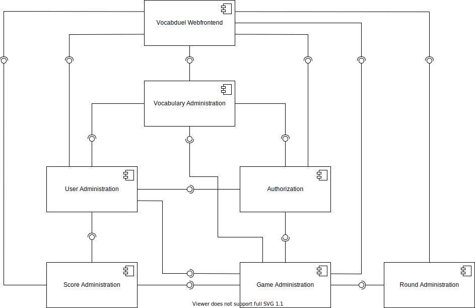
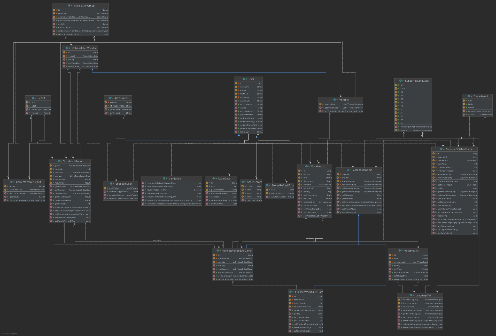
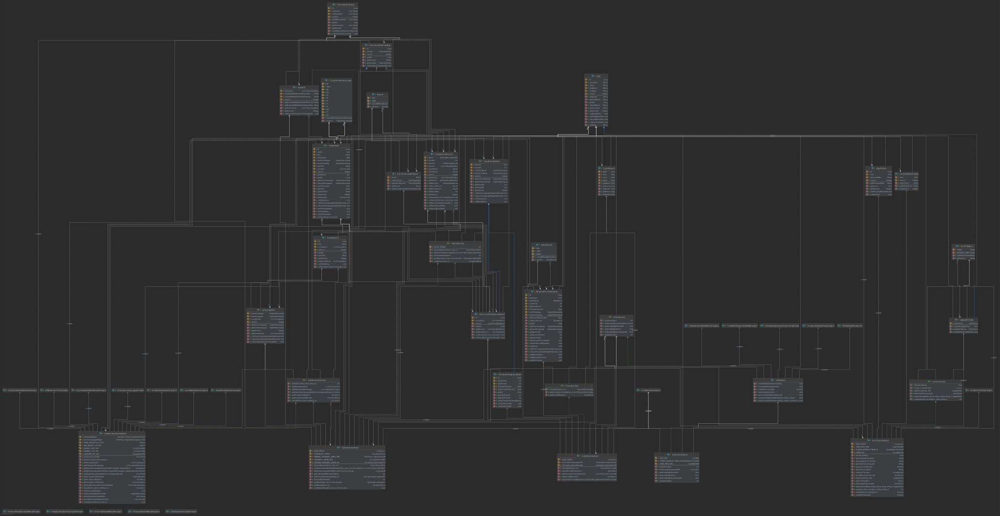

# Vocabduel (Group 7 | KBA | SoSe 2021 | HTW Berlin)

This is a monorepo containing the project directories for each component implemented within the scope of the course
"Komponentenbasierte Entwicklung komplexer Anwendungen" (component-based implementation of complex applications)
at HTW Berlin, University of Applied Sciences.

## Project group

The project group (group 07) consists of the following two students:

- **Sebastian Kehl,** s0550355
- **Lucas Larisch,** s0558070

## Run this project

### Database setup

#### First option: Manual setup

Using a MySQL Server as database, you have to install MySQL from https://dev.mysql.com/downloads/.
We recommend installing the MySQL Installer, where you can decide which type of server you want to install
and add a new user to the server. We are currently using the default root user with password `Test#-#44`.

#### Second option: Docker

You can also use Docker to set up the database by running:

```shell
docker run -p 3306:3306 -e MYSQL_ROOT_PASSWORD="Test#-#44" --name vocabduel-db -d mysql
```

- `-p`: Map exposed port from Docker container to `3306` on your machine (MySQL default port)
- `-e MYSQL_ROOT_PASSWORD="Test#-#44"`: Set the password for the DB's root user
- `--name vocabduel-db`: Name the container `vocabduel-db` (optional)
- `d`: Run container in detached mode (optional)

### Run UI

In order to start the command line interface for this application, please run the main method of the following class:

```
configuration/src/main/java/de/htwberlin/kba/gr7/vocabduel/configuration/ConfigurationSpringImpl.java
```

## Diagrams

The following two images are scalable vector graphics (`.svg` files) which means you can scale them easily if they are
displayed too small in this README.

If there are differences between the graphic integrated in this README and the file you opened, e.g. class icons not
shown in the UML diagram, try to open the respective file itself (same directory level as this README).

### Components

A diagram visualizing which components are interacting in which way can be seen here (`./components_diagram.svg`):

_**Note:** At the moment, the webfrontend component is only conceptual. However, it is displayed in the diagram because in
the future, it could either directly communicate with the modules (as microservices) or communicate through an
interconnected backend._



### UML

_**Note:**_ From our point of view, components should only provide what is actually needed. Some information, however, should not leave the component. Examples include:
- Exported class `User` &rarr; no password property
- Exported class `VocabduelRound` &rarr; no `correctAnswer` property since the data will be visible in the client/accessible through an API and, if the correct answer is included, the game could easily be manipulated when checking the network console

#### Model only

A diagram visualizing the defined model and its relationships can be seen here (`./class-diagram.svg`):



#### All Java files

If all Java files, i.e. Exceptions and Interfaces in addition to the classes in the diagram above, are of interest,
please check the visualization here (`./complete-class-diagram.svg`):



[comment]: <> (TODO: check if diagram has been inserted correctly after having generated it)

## Developer information

### IDE

This project has been implemented using IntelliJ IDEA Ultimate. However, the necessary files for importing it as an
Eclipse project (from zip) have been added, too. If you have troubles with Eclipse (even though the import has been
tested carefully) or any other IDE, please feel free to contact us.

### Generate diagrams

#### Component diagram

The component diagram has been generated using draw.io. If you have access to this repository, select GitHub as file
source, authenticate and open/edit it there. Please make sure to both commit changes in both the `.io` and the `.svg`
file.

#### UML

UML diagrams can be generated in IntelliJ (`.uml` files) and then be exported to `.svg`.

Due to incompatibility issues with shared `.uml` files, the file `class-diagram.uml` is not under version control. These
are the steps to reproduce the class diagram:

0. **Prerequisites** - If you already have a file `class-diagram.uml`, continue with **1)**, otherwise generate it:
    - In IntelliJ, left click on the repository root directory
    - New &rarr; Diagram &rarr; Java Class Diagram
    - In the following dialog:
        - Make sure you save the file in the repository root
        - Name it `class-diagram.uml`
1. **Import the data** - Drag and drop each Java class etc. to be displayed into the diagram (make sure you do not drop
   packages)
1. **Show the data** - In the top bar, select:
    - _Fields_
    - _Methods_
    - _Visibility_ &rarr; _All_
    - _Show dependencies_
1. **Auto-format the data** - In the top bar, select:
    - _Fit Content_
    - _Apply Current Layout (F5)_
1. **Export** - Export the data as `svg`:
    - Make sure, no diagram element is selected
    - In the top bar, select: _Export to Image File..._
    - In the following dialog:
        - Make sure you save the file in the repository root
        - Name it `class-diagram.svg` (`complete-class-diagram.svg` for all Java files) (or simply select `svg` in the
          file format dropdown)
        - Accept the dialog informing about replacing the current file
