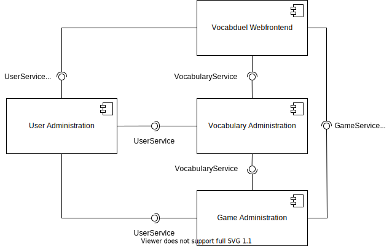

# Vocabduel (Group 7 | KBA | SoSe 2021 | HTW Berlin)

This is a monorepo containing the project directories for each component implemented within the scope of the course
"Komponentenbasierte Entwicklung komplexer Anwendungen" (component-based implementation of complex applications)
at HTW Berlin, University of Applied Sciences.

## Project group

The project group (group 07) consists of the following two students:

- **Sebastian Kehl,** s0550355
- **Lucas Larisch,** s0558070

## Diagrams

The following two images are scalable vector graphics (`.svg` files) which means you can scale them easily if they are
displayed too small in this README.

If there are differences between the graphic integrated in this README and the file you opened, e.g. class icons not
shown in the UML diagram, try to download it and open the downloaded file.

### Components

A diagram visualizing which components are interacting in which way can be seen here:

### Classes (UML)

A diagram visualizing the defined classes and their interactions/relationships can be seen here:

UML diagrams can be generated in IntelliJ (`.uml` files) and then be exported to `.svg`.

Due to incompatibility issues with shared `.uml` files, the file `class-diagram.uml` is not under version control. These
are the steps to reproduce the class diagram:

0. **Prerequisites** - If you already have a file `class-diagram.uml`, continue with **1)**, otherwise generate it:
    - In IntelliJ, left click on the repository root directory
    - New &rarr; Diagram &rarr; Java Class Diagram
    - In the following dialog:
        - Make sure you save the file in the repository root
        - Name it `class-diagram.uml`
1. **Import the data** - Drag and drop each Java class, enum and interface of each module into the diagram (make sure
   you do not drop packages)
1. **Show the data** - In the top bar, select:
    - _Fields_
    - _Methods_
    - _Visibility_ &rarr; _All_
    - _Show dependencies_
1. **Auto-format the data** - In the top bar, select:
    - _Fit Content_
    - _Apply Current Layout (F5)_
1. **Export** - Export the data as `svg`:
    - Make sure, no diagram element is selected
    - In the top bar, select: _Export to Image File..._
    - In the following dialog:
        - Make sure you save the file in the repository root
        - Name it `class-diagram.svg` (or simply select `svg` in the file format dropdown)
        - Accept the dialog informing about replacing the current file
