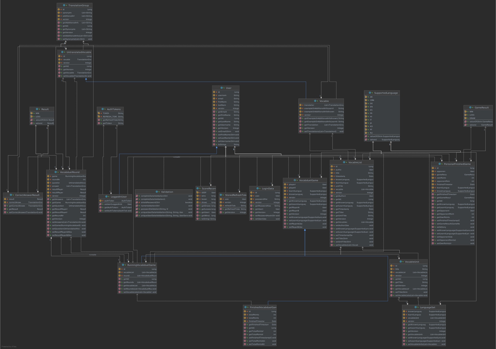

# Vocabduel (Group 7 | KBA | SoSe 2021 | HTW Berlin)

This is a monorepo containing the project directories for each component implemented within the scope of the course
"Komponentenbasierte Entwicklung komplexer Anwendungen" (component-based implementation of complex applications)
at HTW Berlin, University of Applied Sciences.

## Project group

The project group (group 07) consists of the following two students:

[comment]: <> (TODO: Add student number)

- **Sebastian Kehl,** s0550355
- **Lucas Larisch,** s0558070

## Diagrams

The following two images are scalable vector graphics (svg files) which means you can scale them easily if they are displayed too small in this README.

If there are differences between the graphic integrated in this README and the file you opened, e.g. class icons not shown in the UML diagram, try to download it and open the downloaded file.

### Components

A diagram visualizing which components are interacting in which way can be seen here:


### Classes (UML)

A diagram visualizing the defined classes and their interactions/relationships can be seen here:



## Build

The `/target` directories of the respective Maven modules are not under version control. However, you can build them easily by running a custom Shell script:

```shell
sh cleaninstalleach.sh
```

This script builds the modules in the correct order.

If you are not using Mac OS/Linux, you can still run this command using a Git bash.
