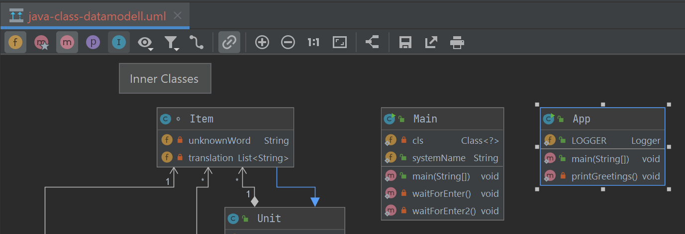
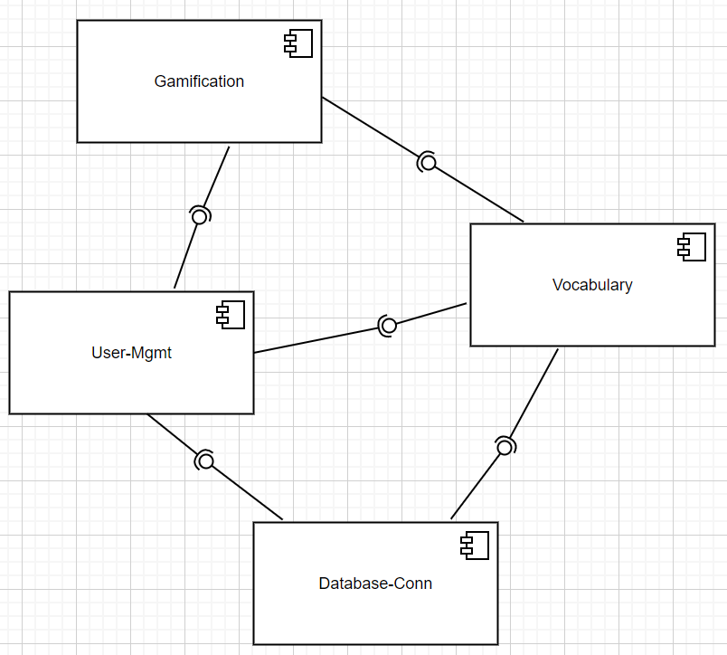

# Java Class Datamodell
zur vollständigen Anzeige bitte das Datenmodell sichtbar machen. 
Anschließend sind bei der Schaltfläche die Buttons "Felder", "Methoden" und "Abhängigkeiten anzeigen" auszuwählen.

# component diagram
go to draw.io and open the file component-dia.drawio
