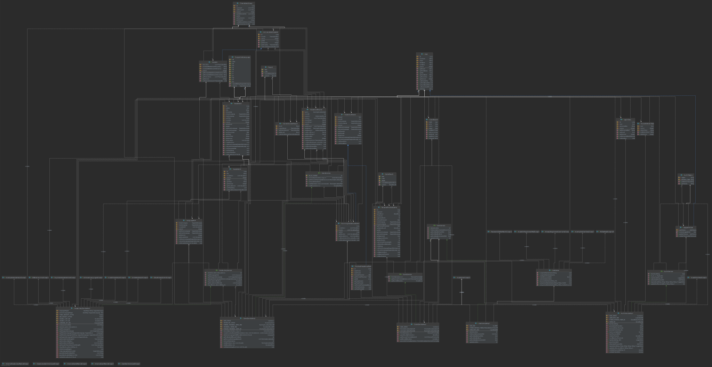

# 1. Komponentenschnitt

Das Informationssystem besteht aus folgenden Komponenten:
- vocabulary_administration
- game_administration
- user_administration
- vocabduel_ui
- configuration

vocabulary_administration ist für die Vokabel-Management zuständig:
Die Komponente stellt den Lese- und Schreibzugriff von Vokabellisten auf der Datenbank,
setzt die Struktur der Vokabellisten und der zugehörigen Entitäten vor und bietet
eine REST-API für den Datenbankzugriff auf die Vokabellisten an.

game_administration ist für das Spiel-Management zuständig:
Auch diese Komponente stellt einen Lese- und Schreibzugriff auf der Datenbank, dieses mal für 
Entitäten, die einem noch laufenden oder schon abgeschlossenen Spiel zugeordnet werden können.
Die betreffenden Entitäten wurden in dieser Komponente definiert.
Zusätzlich wird eine REST-API für den Datenbankzugriff auf die Spiele angeboten.

user_administration ist für das Nutzer-Management zuständig:
Diese Komponente ist die dritte und letzte, welche eine Rest-API für den Lese- und Schreibzugriff 
auf die Datenbank anbietet. Dieses mal allerdings nur für definierte Entitäten, die einem
ggf. eingeloggten Nutzer und seinem Autorisierungstoken-Management zugeordnet werden können.
Der Nutzer loggt sich ein und erhält einen Token, der für eine bestimmte Zeit gültig ist. Ist er nicht mehr
gültig, so wird ein neuer erzeugt und dem noch immer eingeloggten Nutzer
zugeordnet sowie übergeben (an den Client).

Die Komponente vocabduel_ui stellt das User Interface zum Projekt, welches auf der Konsole ausgeführt wird.

Schließlich gibt es noch die configuration Komponente, welche die Konfiguration zu den Technologien 
Hibernate EntityManager und Spring RestEasy beinhalten. Außerdem sind hier das Angular Frontend und die 
Starter-Datei zum Konsolen UI zu finden.

[comment]: <> (Add ideas here)

# 2. Schnittstellenbeschreibung

Tools -> Generate JavaDoc...

custom Scope: Interface files of:
- user_administration.export
- game_administration.export
- vocabulary_administration.export

Output directory: /.javadoc

[comment]: <> (Add ideas here)

# 3. Konzeptionelles Datenmodell

Beschreibung:

[comment]: <> (Add ideas here)

# 4. Präsentationsschicht

[comment]: <> (Add ideas here)

# 5. Frameworks

Für dieses Java Maven-Projekt wurde Hibernate genutzt, um aus den models
eine MySQL Datenbank anzulegen und zu verwalten.
Dazu wird ein EntityManager genutzt, der auf eine konfigurierte persistence.xml zugreift,
in der steht, auf welche MySQL Datenbank mit welchem User wie zugegriffen werden soll
und welche models zur Datenbankerzeugung genutzt werden sollen.

Auf einem Tomcat Server der Version 9.0.40 läuft der Spring RestEasy Server, welcher
in der Rest-Schicht des configuration Moduls konfiguriert wird.
Die Rest-Schichten der Module game_administration, user_administration und vocabulary_administration
wurden als Dependencies angegeben und die Beans, in denen die REST HTTP Methoden definiert sind,
dem Server hinzugefügt.

Für die Benutzeroberfläche wird Angular genutzt.

Die JUnit Tests werden mit dem Mockito Framework durchgeführt.
Normalerweise wird der MockitoJUnitRunner genutzt, um die Tests zu starten.
Bei den InvalidPwdsTests und bei den ValidPwdsTests starten die Tests allerdings parametriesiert.

Über Maven Executions werden Node, npm und Angular installiert, damit das Frontend anschließend starten kann.

[comment]: <> (Add ideas here)

# 6. Ablaufumgebung

Zum Starten dieses Projektes sind eine MySQL Datenbank und ein Tomcat Server der Version 9.0.40 notwendig.
Außerdem muss Maven der Version > 3.6 installiert sein.
Die Datenbank wird über die configuration_core/src/main/resources/META-INF/persistence.xml und 
das /java/de.htwberlin.kba.gr7.vocabduel.configuration_core/EntityFactoryManagement konfiguriert.
Der Tomcat Server wird über die .run/Tomcat 9.0.40.run.xml konfiguriert.

Über den Befehl mvn clean install werden die Dependencies geladen.
Außerdem werden node, npm und angular installiert.
Die generierte war-Datei configuration.rest/target/configuration.rest-1.0SNAPSHOT.war 
wird beim Start des Tomcat Servers deployt.

Der Browser öffnet sich mit der URL http://localhost:8080/api.
Über /api wird die REST-API genutzt.
Über /app läuft das Frontend.

[comment]: <> (Add ideas here)
